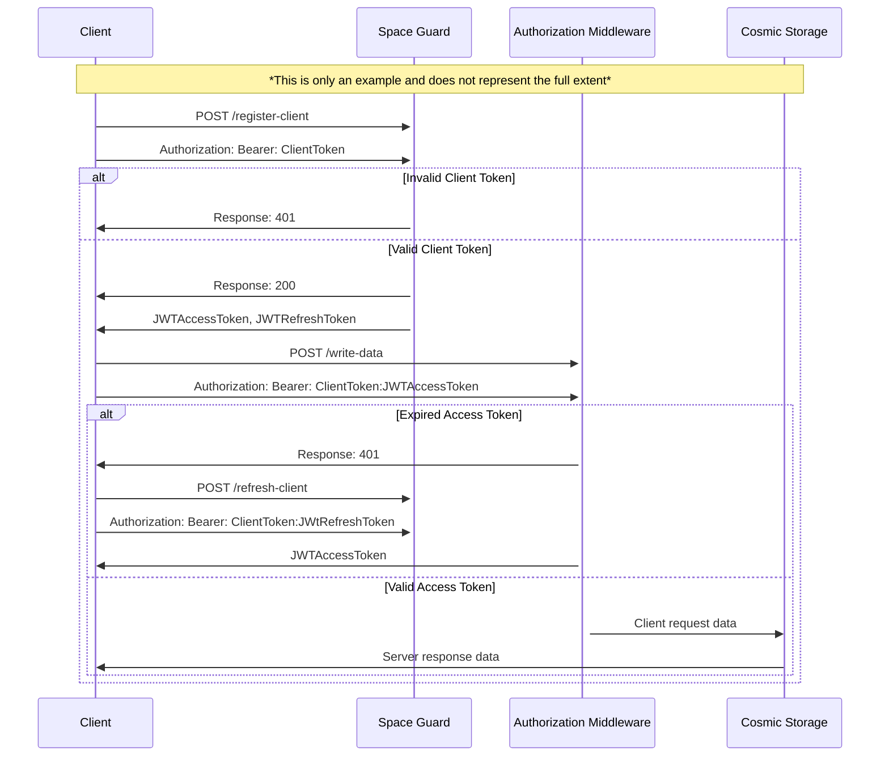

# **Loopware Online Subsystem Server: Space Guard Service**
## ***Authorization Route***

---

### Description:
The Space Guard authorization endpoint is the main *"gateway"* between you, as the client, and the Loopware Online Subsystem Server (Loss) instance. Using an OAUTH 2.0 flow along with JsonWebTokens (JWT's) the Space Guard service is able to provide a secure and manageable way of communication with Loss

---

### Examples:

#### OAUTH 2.0 Flow Example



---

### Endpoints


```http
# /register-client | Registers the client with Loss: Space Guard Service

#<-->#

POST https://localhost:8080/space-guard/api/v1/register-client
Authorization: Bearer: ClientToken

#<-->#

Returns: { "code": ResponseCode, "message": ServerMessage, data: { "jwtAccessToken": Token, "jwtRefreshToken": Token, }, }
```

---

```http
# /refresh-client | Refreshes the client access token

#<-->#

POST https://localhost:8080/space-guard/api/v1/refresh-client
Authorization: Bearer: ClientToken:jwtRefreshToken

#<-->#

Returns: { "code": ResponseCode, "message": ServerMessage, data: { "jwtAccessToken": Token, }, }
```

---

```http
# /logout-client | Invalidates the refresh and access token essentially "logging out" from Loss services

#<-->#

POST https://localhost:8080/space-guard/api/v1/logout-client
Authorization: Bearer: ClientToken:jwtRefreshToken

#<-->#

Returns: { "code": ResponseCode, "message": ServerMessage, }
```

---