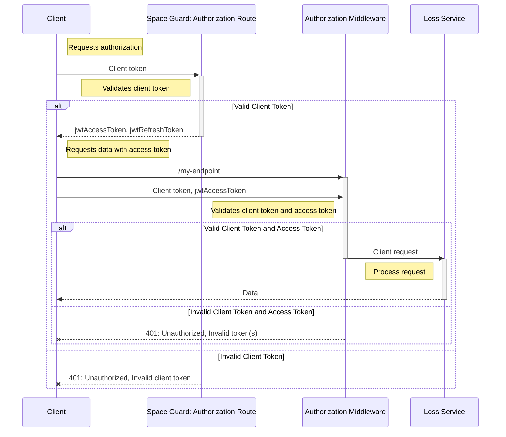

# **Loopware Online Subsystem Server: Space Guard Service**
## ***Authorization Route***

---

### Description:
The **Space Guard Authorization Route** is the main *"gateway"* between you, as the client, and the Loopware Online Subsystem Server (Loss) instance. Using an OAUTH 2.0 flow along with Json Web Tokens (JWT's) the **Space Guard Authorization Route** is able to provide a secure and manageable way of communicating with Loss

---

### Diagrams:
#### OAUTH 2.0 Flow
A simple overview on how OAUTH 2.0 is done in Loss


---

### Examples:
#### Register Client
Registers a client with Loss
```http
POST https://localhost.com/space-guard/api/v1/register-client
Authorization: ClientToken
```

---

#### Refresh Client
Refreshes a client's access token
```http
POST https://localhost.com/space-guard/api/v1/refresh-client
Authorization: ClientToken:jwtRefreshToken
```

---

#### Logout Client
Invalidates a client's access token and refresh token
```http
POST https://localhost.com/space-guard/api/v1/logout-client
Authorization: ClientToken:jwtRefreshToken
```

---